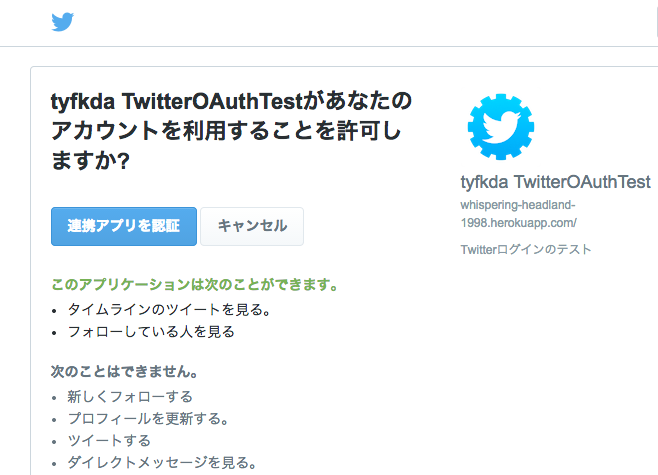

TwitterのOAuth認証を使ってみる
============================

ユーザログインが必要なウェブサービスを作りたいが、ユーザの心理的に新たなウェブサービスに
対してユーザ名とパスワードを登録するのってハードルが高いと思う。
そこで既存のサービスのアカウント情報を使ってログインできるようにしたい。

ここではTwitterの認証を使ってアカウント情報に紐付けるアプリを作ってみたい。
アプリはHerokuを使ってデプロイする。言語はRuby、フレームワークはSinatraを使う。

[コード](https://github.com/tyfkda/twitter-oauth-test), [デモ](https://tyfkda-twitter-oauth.herokuapp.com/)

### Twitterへのアプリの登録

Twitterの認証を使えるようにするために、Twitterにアプリを登録する。

* [Twitter Application Management](https://apps.twitter.com/)にアクセスして、
  [Create New App] で新規アプリを登録する。
  * アプリ名、説明、ウェブサイト、コールバックURL を登録する
  * ウェブサイトとコールバックURLは適当に設定しておいて、Herokuでアプリをデプロイしてから
    後でちゃんと設定する
  * コールバックURLは必須マークが付いてないけど、設定しないと動かなかった
  * コールバックURLはTwitterで認証が成功または失敗したときに呼び出される、アプリ側のURL
    となる

### Sinatraでアプリの作成

実際にウェブアプリを作っていく。ここではシンプルに[Sinatra](http://www.sinatrarb.com/)を
使う。

Gemfile

```rb
source 'https://rubygems.org'
gem 'sinatra'
```

app.rb

```rb
require 'sinatra'

get '/' do
  erb :index
end
```

views/index.erb

```html
<!DOCTYPE html>
<html>
  <body>
    Hello, world
  </body>
</html>
```

`bundle install` で必要なライブラリをインストールして、`bundle exec ruby app.rb` で
サーバを起動させる。
デフォルトだとローカルの http://localhost:4567/ でアクセスできる。

### Twitter認証の呼び出し

TwitterのOAuthを使って認証をする。実際には gem の twitter_oauth を使う。

htmlで `/request_token` へのリンクを表示して、アクセスされたら実際に認証の手順を進める。

Gemfile

```rb
gem 'twitter_oauth'  # 追加
```

views/index.erb

```html
    <a href="/request_token">Twitter Login</a>
```

app.rb

```rb
require 'twitter_oauth'

enable :sessions

before do
  key = 'Twitterアプリのコンシューマキー'
  secret = 'Twitterアプリのコンシューマシークレット'
  @twitter = TwitterOAuth::Client.new(
      :consumer_key => key,
      :consumer_secret => secret,
      :token => session[:access_token],
      :secret => session[:secret_token])
end

get '/request_token' do
  callback_url = "#{base_url}/access_token"
  request_token = @twitter.request_token(:oauth_callback => callback_url)
  session[:request_token] = request_token.token
  session[:request_token_secret] = request_token.secret
  redirect request_token.authorize_url
end

def base_url
  default_port = (request.scheme == "http") ? 80 : 443
  port = (request.port == default_port) ? "" : ":#{request.port.to_s}"
  "#{request.scheme}://#{request.host}#{port}"
end
```

* Sinatraの`before`フィルタを使って、TwitterOAuth::Clientを作成する
* `/request_token`に`get`でアクセスされた時、そのtwitter用のoauthクライアントの
  `request_token` を呼び出してやる。
  * `:oauth_callback` に認証が成功または失敗した時に呼び出してもらうURLを指定する
* 後で認証結果を処理するときのために、セッションにリクエストのトークンとシークレットを
  保存しておく

リンクをクリックするとアプリ情報を持ってTwitter側の `request_token.authorize_url` に
リダイレクトされ、おなじみの連携画面が表示される：



ここで連携を認証またはキャンセルすると、コールバックURL (/accesss_token) に戻ってくる。

### 認証結果の取得

Twitterから戻ってきた認証結果を取得する。

views/app.rb

```rb
get '/access_token' do
  begin
    @access_token = @twitter.authorize(session[:request_token], session[:request_token_secret],
                                       :oauth_verifier => params[:oauth_verifier])
  rescue OAuth::Unauthorized => @exception
    return erb :authorize_fail
  end

  session[:access_token] = @access_token.token
  session[:access_token_secret] = @access_token.secret
  session[:user_id] = @twitter.info['user_id']
  session[:screen_name] = @twitter.info['screen_name']
  session[:profile_image] = @twitter.info['profile_image_url_https']

  redirect '/'
end
```

* コールバックURLのパラメータに渡された`oauth_verifier`が正しいかどうか、
  `TwitterOAuth::Client#authrize`で認証する。
* 認証に成功したら`info['user_id']`にTwitterのユーザID、`info['screen_name']`に名前、
  `info['profile_image_url_https']`にアイコン画像のURLが入っているので、アプリ側で
  使える。
* TwitterのAPIを使ってタイムラインを取得したりする場合にはアクセストークンとか
  アクセストークンシークレットを使う

### Herokuにデプロイ

Herokuにデプロイできるようにするために、設定ファイルを追加する。

config.ru

```rb
require 'bundler'
Bundler.require

require './app'
run Sinatra::Application
```

Herokuコマンドでアプリの登録などを行う

* `heroku login`
* `heroku create`
* `git push master heroku`

### キーやシークレットを環境変数から取得し、ソースに含めないようにする

Twitterのアプリのコンシューマキーやシークレットをソースに書いていたけどそれはあまりよくないし、
githubなどにアップロードしてしまうのは問題がある。
そこでソースコードからは外して環境変数に入れて使えるようにする。

環境変数に入れるにはシェルで設定する

```bash
$ export CONSUMER_KEY="..."
$ export CONSUMER_SECRET="..."
```

Sinatraアプリから参照するには `ENV` を通して

```rb
  key = ENV['CONSUMER_KEY']
  secret = ENV['CONSUMER_SECRET']
```

とできる。

Herokuで使えるようにするには `heroku config:add` で設定する：

```bash
$ heroku config:add CONSUMER_KEY="..."
$ heroku config:add CONSUMER_SECRET="..."
```


### 他

* Sinatraでセッション情報を`session`に保存するけど、`enable :sessions`を指定しないと
  ちゃんと保存できない？ことがある。でも指定するとセッション情報をすべてをクッキーで送る？
  とかいう情報があるので、ちゃんとした方がいいかも。
* Twitterのアプリの設定画面に「Allow this application to be used to Sign in with
  Twitter」というチェックボックスがあるが、どういう項目かよくわからなかった
